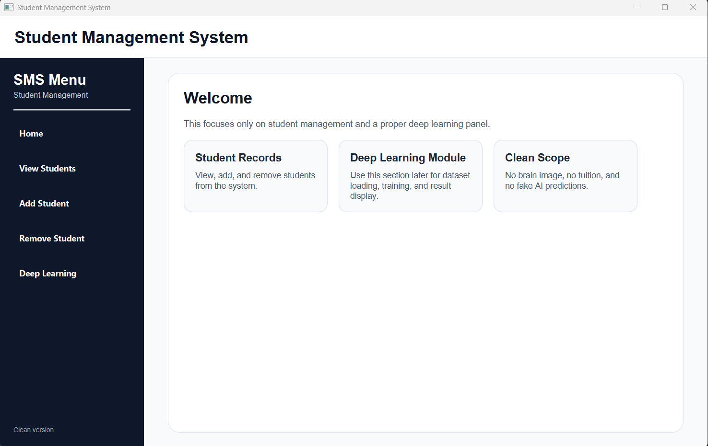
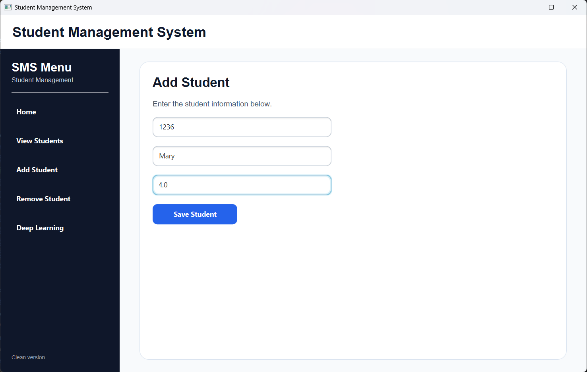
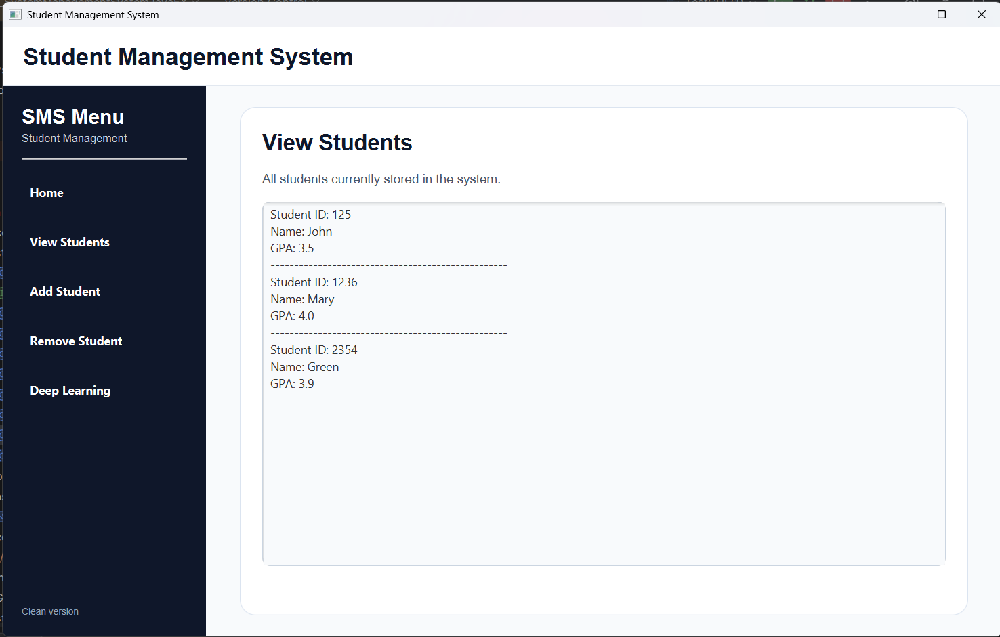
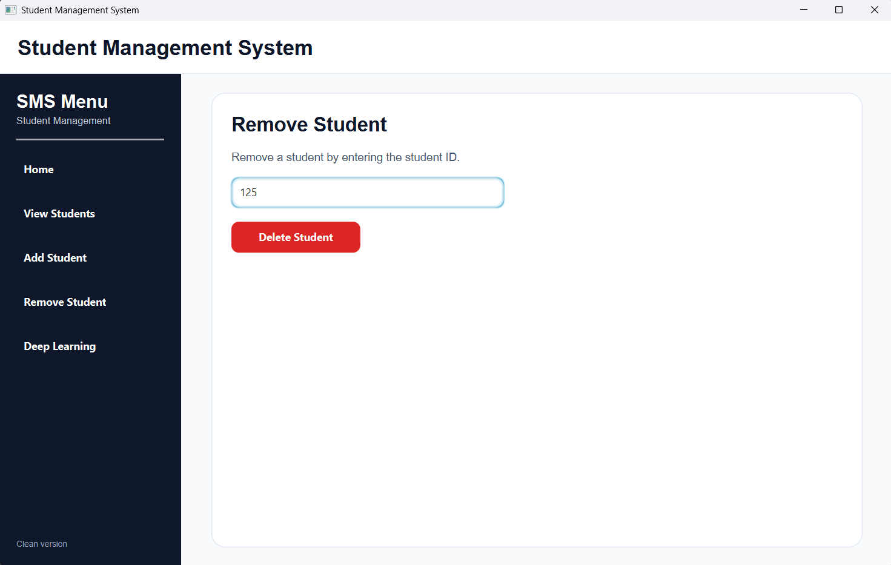
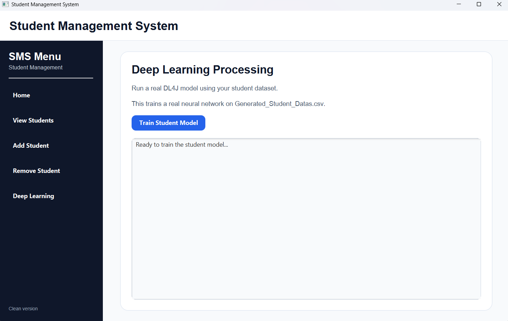
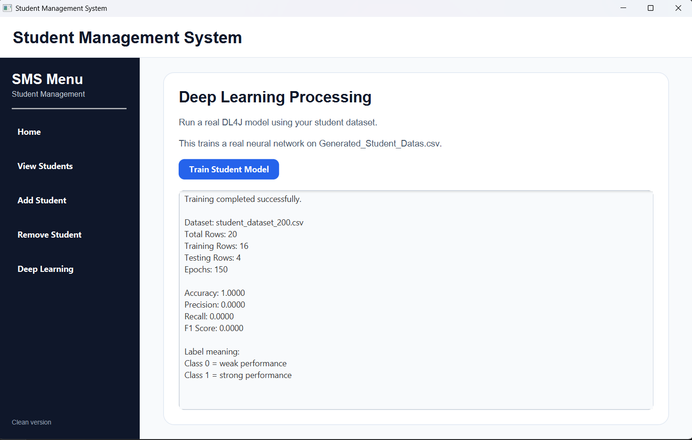

# Hybrid Student Management System JavaFX DL4J

AI-enhanced student management and educational analytics system integrating JavaFX, Maven, and DeepLearning4J (DL4J).

---

# Project Overview

This project extends a traditional Java-based Student Management System into a modern JavaFX desktop application integrated with educational analytics and deep learning capabilities.

The system combines:
- object-oriented software engineering,
- desktop GUI development,
- educational performance analytics,
- and foundational deep learning integration using DL4J.

The application supports student record management while demonstrating how machine learning workflows can be integrated into educational software systems.

---

# Features

## Student Management
- Add students
- View student records
- Remove students
- GPA management
- Course management

## JavaFX Desktop Interface
- Sidebar navigation dashboard
- Responsive GUI panels
- Modern JavaFX styling
- User-friendly desktop workflow

## Deep Learning Integration
- DL4J neural network training
- Dataset loading from CSV
- Student performance classification
- Training metrics display
- Educational analytics processing

## Educational Analytics
- Student performance monitoring
- Weak vs strong performance classification
- Accuracy, precision, recall, and F1 score reporting

---

# Technologies Used

- Java 17
- JavaFX
- Maven
- DeepLearning4J (DL4J)
- ND4J
- Object-Oriented Programming (OOP)
- Educational Analytics
- Machine Learning Fundamentals

---

# Application Screenshots

## Home Dashboard



---

## Add Student Interface



---

## Add Student Success Confirmation


---

## View Students



---

## Remove Student



---

## Deep Learning Processing



---

## Trained Student Model Results



---

# Project Structure

```text
hybrid-student-management-system-javafx-dl4j/
│
├── docs/
├── screenshots/
├── src/
│   └── main/
│       ├── java/
│       └── resources/
├── .mvn/
├── pom.xml
├── mvnw
├── mvnw.cmd
└── README.md
```

---

# How to Run

## Clone Repository

```bash
git clone https://github.com/ThereseK02/hybrid-student-management-system-javafx-dl4j.git
```

## Navigate Into Project

```bash
cd hybrid-student-management-system-javafx-dl4j
```

## Run Using Maven

```bash
mvn clean compile
mvn javafx:run
```

---

# Deep Learning Workflow

The project integrates DL4J to demonstrate a foundational educational machine learning workflow.

The application:
- loads student datasets from CSV files,
- preprocesses data,
- trains a neural network model,
- evaluates prediction metrics,
- and displays educational analytics results inside the JavaFX interface.

---

# Future Improvements

- Database integration
- Role-based authentication
- Enhanced analytics dashboards
- Larger datasets for training
- Improved model accuracy
- Visualization charts
- REST API integration

---
# Key Contributions

- Designed and developed a JavaFX-based desktop student management application
- Integrated DeepLearning4J (DL4J) for educational analytics experimentation
- Implemented student dataset loading and neural network training workflows
- Developed modular object-oriented system architecture using Java and Maven
- Created interactive GUI panels for student management and analytics processing
- Applied machine learning fundamentals to student performance classification
- Structured the project for professional GitHub portfolio presentation

---

# Final Conclusion

This project demonstrates the integration of software engineering principles, JavaFX desktop development, educational analytics, and foundational deep learning workflows within a single academic application.

The system highlights how machine learning concepts can be incorporated into educational management platforms while maintaining clean object-oriented architecture and modern desktop interface design.

The project also strengthened practical experience in:
- Java application development
- Maven project management
- JavaFX GUI engineering
- DL4J integration
- Git and GitHub workflows
- technical documentation and software presentation

---
# Author

Therese Kabayanja

Machine Learning Engineer | Data Scientist | Software Engineer
